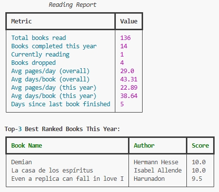
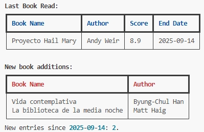

# Book Tracker

A Python project to track and analyze personal reading habits.  
It follows an **ELT pipeline** (Extract → Load → Transform → Report) and generates summary tables about books read over time.  

---

## Features
- Extracts new entries from a Google Sheets database.
- Tracks new additions in a CSV file.
- Gives the option to save the files locally for firther analysis.
- Transforms the data to calculate metrics like:
  - Reading duration (days per book).
  - Pages per day.
- Generates tables to report the following statistics:
  - Total books read overall and in the current year.
  - Ongoing and dropped books.
  - Average reading pace.
  - Top-3 books (by score).
  - Last completed book.

---

## Project Structure
```text
- book_tracker/
  - assets/ # Contains screenshots
  - .datasets/
    - raw_books_current.csv # not included
    - raw_consolidate.csv # Not included
    - raw_records.csv
  - .devcontainer/
  - elt/
    - exceptions.py
    - extract.py
    - load.py
    - logger.py
    - transform.py
  - manipulation/
    - generate_report.py
    - summary.py
  - simulated_database/ # Shows the structure of the data used
    - simulated_books.csv
    - simulated_consolidate.csv
  - general_schema.py # Structure: 1st version
  - general_schema_v2.py # Structure: 2nd version
  - load_credentials.py
  - main.py # Main modularized Python script
  - .gitignore
  - README.md
  - requirements.txt
  - setup.sh
  - test.ipynb
  - load_credentials_process.md
```

---

## Images
**Example output**





---

**Notes**

- The `database/` folder is excluded from version control for privacy reasons.
- A small fake database (`simulated_database/`) is provided to show the structure of the data I used.
- I created this project to track new additions and calculate statistics on my own data. I saw it as a good opportunity to apply ELT principles, which is why I designed this specific solution instead of opting for a simpler approach. 

---
