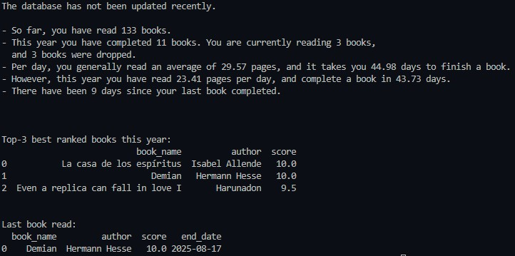

# Book Tracker 📚

A Python project to track and analyze personal reading habits.  
It follows an **ELT pipeline** (Extract → Load → Transform → Report) and generates summaries about books read over time.  

---

## Features
- Extracts new entries from an Excel database, hosted on OneDrive and synced locally.
- Loads and consolidates updates into a CSV database.
- Transforms the data to calculate metrics like:
  - Reading duration (days per book).
  - Pages per day.
- Generates a text-based report with statistics:
  - Total books read overall and in the current year.
  - Ongoing and dropped books.
  - Average reading pace.
  - Top-3 books (by score).
  - Last completed book.

---

## Project Structure
```text
- book_tracker/
  - assets/ # Contains screenshots
  - database/ # Not included in the repository
    - books.csv
    - categorical_vars.csv
    - consolidate.csv
    - textbooks.csv
  - elt/
    - extract.py
    - load.py
    - transform.py
  - manipulation/
    - generate_report.py
    - summary.py
  - simulated_database/ # Shows the structure of the data used
    - simulated_books.csv
    - simulated_consolidate.csv
  general_schema.py # Contains all functions in a single file
  main.py # Main modularized Python script
  .gitignore
  README.md
  requirements.txt
```

---

## Images


---

**Notes**

- The `database/` folder is excluded from version control for privacy reasons.
- A small fake database (`simulated_database/`) is provided to show the structure of the data I used.
- The file I retrieve data from is synced locally through OneDrive.
- I created this project to synchronize changes from an Excel file stored online and maintain an up-to-date local backup. I saw it as a good opportunity to apply ELT principles, which is why I designed this specific solution instead of opting for a simpler approach. 

---
